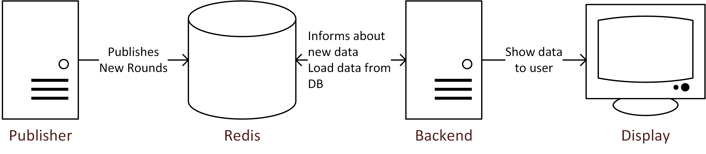

# Welcome

This is a small example project for introducing the Redis database.

Most of the code was written by [Michael Schweiker](https://github.com/Stainzl).

# Structure

```
.
+-- redis/                              Entry point
|   +-- publisher/                      Java Redis publisher 
|   +-- webserver/                      Java Spring Backend
        +--src/main/resources/static    Leaderboard Frontend
```

# How to run this project

You need to have a local Redis instance running on port 6379.
Then just start the two applications.
Visit localhost:8080 with your browser, the leaderboard will be displayed there.

# Architecture

